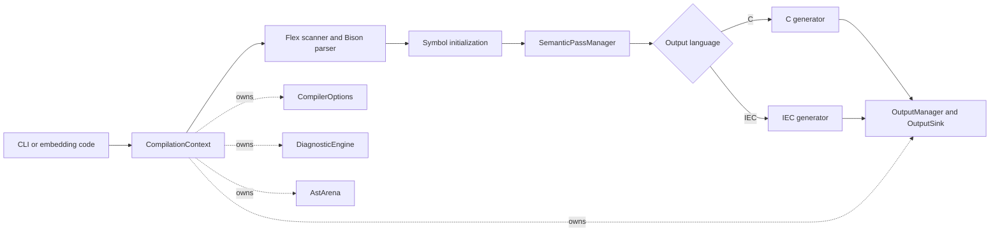

# MATIEC

[](https://github.com/mengmengjiang1999/matiec/actions/workflows/ci.yml)

MATIEC is an open-source compiler for the textual languages defined by
IEC 61131-3. It translates programs used in programmable logic controllers
(PLCs) into C, and it can also emit normalized IEC source for frontend and
diagnostic work.

This repository modernizes the original MATIEC implementation without
deliberately changing its accepted language or generated-code behavior. The
compiler now has an explicit per-compilation context, structured diagnostics,
an ordered semantic-pass pipeline, owned AST lifetime, output abstractions, and
automated cross-platform regression coverage.

> [!WARNING]
> MATIEC is not intended for safety-critical use without a complete,
> application-specific review and validation process.

## Language and output support

| Language or format | Support | Notes |
| --- | --- | --- |
| Structured Text (ST) | Yes | Textual IEC 61131-3 input |
| Instruction List (IL) | Yes | Textual input based on the project's IEC 61131-3 2nd Edition grammar |
| Sequential Function Chart (SFC) | Yes | Textual representation |
| Function Block Diagram (FBD) | No direct parser | Graphical representation is outside the current frontend |
| Ladder Diagram (LD) | No direct parser | Graphical representation is outside the current frontend |
| ANSI C | Generated by `iec2c` | Intended for a separate C compiler and target runtime |
| Normalized IEC source | Generated by `iec2iec` | Primarily for frontend development and regression analysis |

ST, IL, and textual SFC declarations may coexist in one input file. MATIEC also
supports its historical include pragma:

```text
{#include "filename" }
```

## Build

### Requirements

- Autoconf 2.69 or newer
- Automake 1.16 or newer
- Bison 2.4 or newer
- Flex 2.6 or newer
- GNU Make or a compatible Make implementation
- A C and C++ compiler

GCC on Linux and Clang on macOS are exercised by CI.

### From a Git checkout

```sh
autoreconf --install
./configure
make --jobs=2
make check
```

The generated `configure` script and `Makefile.in` templates are committed. A
prepared source archive can start at `./configure`; a Git checkout should run
the complete bootstrap sequence above.

See [README.build](README.build) for supported tool versions, MinGW
cross-compilation, sanitizer targets, and the policy for generated Autotools
files.

## Command-line usage

The build creates two executables:

- `iec2c`: validate IEC source and generate C sources and headers.
- `iec2iec`: validate IEC source and write normalized IEC source to standard
  output.

### Generate C

The output directory must already exist:

```sh
mkdir -p build/generated
./iec2c -I lib -T build/generated program.st
```

The exact output set depends on the declarations in the input. It can include
`POUS.c`, `POUS.h`, configuration sources, resource sources, and supporting
headers. Runtime headers for compiling generated C are located in `lib/C`.

### Emit normalized IEC source

```sh
./iec2iec -I lib program.st > normalized.st
```

Both tools accept exactly one input file and return a non-zero status for
argument, parsing, semantic, or output failures. Run either executable with
`-h` to list language extensions, diagnostics, include paths, target paths,
and generator options.

## Architecture



### Compilation lifetime

`matiec::CompilationContext` owns the mutable state of one compilation:

- compiler and generator options;
- collected diagnostics;
- AST nodes and retained parser strings;
- generated-output management;
- the source path.

Destroying the context releases its AST arena. AST pointers must not outlive
their context. Separate contexts can be used for sequential compilations in
one process.

### Frontend boundary

Stage 1 and Stage 2 use the generated Flex scanner and Bison parser. Their
remaining process-wide state is isolated behind
`LegacyGlobalStateAdapter`. This compatibility boundary is synchronous and is
not thread-safe.

### Semantic pipeline

`SemanticPassManager` runs explicitly identified passes in dependency order:

1. enumerated-value declaration analysis;
2. flow-control analysis;
3. constant propagation;
4. declaration safety;
5. type safety;
6. lvalue validation;
7. array-range validation;
8. case-element validation;
9. dependency ordering.

Each pass reports a typed result. A failed prerequisite prevents dependent
passes from running, and diagnostics are collected instead of terminating the
process from a lower compiler layer.

### Generation boundary

Stage 4 selects the C or normalized-IEC generator. Generator implementations
are compiled as ordinary translation units and write through
`OutputManager`. The output layer provides filesystem, stream, and memory
sinks with uniform write and flush error reporting. Memory/custom sinks are
currently available to generator components and tests; the complete compiler
driver still selects its production outputs from `CompilerOptions`.

For detailed invariants and migration constraints, see:

- [Compiler architecture and embedding boundaries](docs/architecture/compiler-boundaries.md)
- [Legacy global-state adapters](docs/architecture/legacy-global-state-adapters.md)
- [AST ownership inventory](docs/architecture/ast-ownership-inventory.md)
- [Architecture decisions](docs/decisions/)

## C++ integration

The command-line parser is separate from the compiler driver. Source-level C++
integrations can construct a context and invoke `matiec::Compiler` directly:

```cpp
#include <iostream>

#include "compiler/compilation_context.hh"
#include "compiler/compiler.hh"

int main() {
  matiec::CompilationContext context;
  context.set_source_path("program.st");
  context.options().include_directory = "lib";
  context.options().output_directory = "build/generated";

  const matiec::CompilationResult result =
      matiec::Compiler().compile(context);
  context.diagnostics().render(std::cerr);
  return result.succeeded() ? 0 : 1;
}
```

This is a source-level integration boundary, not a versioned binary ABI. The
generated frontend remains non-reentrant, so parallel compilations in the same
process are not currently supported.

## Validation

`make check` is the shared regression entry point. It covers:

- compiler value types, diagnostics, context, AST arena, output sinks, and pass
  metadata;
- semantic pass order, prerequisites, and failure short-circuiting;
- invalid-then-valid sequential compilation with isolated context state;
- in-memory generator output;
- CLI success and failure behavior;
- syntax and initialization regressions;
- byte-for-byte generated-output characterization;
- representative generated-C compilation, ABI symbols, linking, and runtime
  behavior.

Sanitizer suites build and test isolated source copies:

```sh
make check-asan
make check-ubsan
```

AddressSanitizer includes leak detection. Test outputs are isolated from
tracked source locations so successful validation leaves the worktree clean.

## Repository layout

| Path | Responsibility |
| --- | --- |
| `compiler/` | Driver, context, diagnostics, AST arena, semantic-pass manager, and output abstractions |
| `stage1_2/` | Scanner, grammar, generated parser, and frontend compatibility state |
| `absyntax/` | Abstract syntax tree nodes and base visitors |
| `absyntax_utils/` | AST traversal, symbol lookup, and type helpers |
| `stage3/` | Semantic analysis passes |
| `stage4/` | C and IEC generation entry points |
| `stage4/generate_c/` | C generator components |
| `stage4/generate_iec/` | Normalized IEC generator |
| `lib/` | IEC standard library and generated-C runtime support |
| `tests/` | CLI, syntax, initialization, characterization, ABI, and sanitizer suites |
| `docs/` | Architecture contracts and design decisions |
| `openspec/specs/` | Current behavior and architecture requirements |
| `openspec/changes/archive/` | Completed OpenSpec change records |

## Development guidelines

Keep observable language and generated-code behavior stable unless a behavior
change is intentional and covered by updated tests. In particular:

- put new per-compilation state in `CompilationContext` or an owned service;
- add semantic work as an identified pass with explicit prerequisites;
- allocate AST-lifetime objects through the context arena;
- write generated output through an `OutputSink`;
- return structured failures and diagnostics instead of calling `exit()` in
  lower layers;
- update `openspec/specs/` when a requirement changes;
- refresh generated Autotools files whenever `configure.ac` or a `Makefile.am`
  changes.

Before publishing a change, run the bootstrap, build, and regression commands
from the [Build](#build) section. Run the sanitizer targets for changes that
affect ownership, parser state, or memory lifetime.

## Current constraints

- The supported grammar originates from the final draft of IEC 61131-3,
  2nd Edition (2001-12-10); this is not a claim of complete support for later
  editions.
- FBD and LD graphical documents are not accepted directly.
- The generated frontend and legacy symbol initialization are not thread-safe.
- Semantic annotations are still stored on AST nodes; moving them to a
  context-owned analysis store is a documented follow-up.
- Generated C must be compiled, linked, and validated for the intended target
  runtime separately from MATIEC.

## Origin, copyright, and license

This repository is derived from the MATIEC project, originally developed by
Mario de Sousa with contributions from Laurent Bessard, Edouard Tisserant, and
other contributors. Original copyright notices are retained in the source
files and remain authoritative.

The MATIEC compiler sources are distributed under the GNU General Public
License as stated in their file headers, generally version 3 or (at your
option) any later version. [COPYING](COPYING) contains the GPL version 3 text.

Some runtime and support files under `lib/`, including files intended for use
with generated C, carry GNU Lesser General Public License notices. See
[lib/COPYING.LESSER](lib/COPYING.LESSER) and each file's header for the
applicable version and terms.

This README summarizes the repository; it does not replace or alter any
copyright or license notice.
