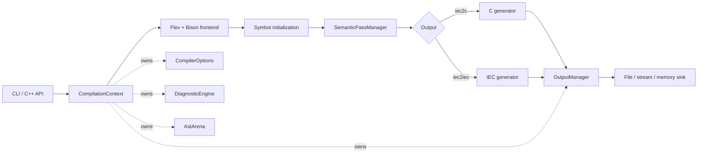

<div align="center">

# MATIEC

### IEC 61131-3 source in. Portable C out.

A modernized, testable compiler pipeline for Structured Text, Instruction List,
and textual Sequential Function Chart programs.

[](https://github.com/mengmengjiang1999/matiec/actions/workflows/ci.yml)


[Get started](#quick-start) · [Use the compiler](#usage) ·
[Explore the architecture](#architecture) · [Read the docs](#documentation)

</div>

---

## Why MATIEC?

MATIEC turns textual PLC programs into C that can be compiled for a target
runtime with a standard C toolchain. This repository keeps the language
behavior of the original MATIEC compiler while rebuilding its internal
boundaries for maintainability, embedding, and regression testing.

| Predictable | Embeddable | Verifiable |
| --- | --- | --- |
| Explicit semantic pass order and structured failures | One `CompilationContext` per compilation | GCC, Clang, generated-C, ABI, runtime, and sanitizer coverage |

> [!IMPORTANT]
> Generated code must be compiled, linked, and validated for its target PLC
> runtime. MATIEC is not approved for safety-critical use without an
> independent, application-specific review.

## What is included?

| Interface | Purpose |
| --- | --- |
| `iec2c` | Validate IEC 61131-3 source and generate ANSI C sources and headers |
| `iec2iec` | Validate source and emit normalized IEC text |
| `matiec::Compiler` | Invoke the compiler from C++ without command-line parsing |

### Language coverage

- **Structured Text (ST)** — supported
- **Instruction List (IL)** — supported
- **Sequential Function Chart (SFC)** — supported in textual form
- **Function Block Diagram (FBD)** — graphical input is not parsed directly
- **Ladder Diagram (LD)** — graphical input is not parsed directly

ST, IL, and textual SFC declarations can coexist in the same input file. The
frontend follows the project's IEC 61131-3 2nd Edition grammar and also accepts
the historical include pragma:

```text
{#include "filename" }
```

## Quick start

```sh
git clone git@github.com:mengmengjiang1999/matiec.git
cd matiec

autoreconf --install
./configure
make --jobs=2
make check
```

<details>
<summary><strong>Build prerequisites</strong></summary>

| Tool | Minimum version |
| --- | --- |
| Autoconf | 2.69 |
| Automake | 1.16 |
| Bison | 2.4 |
| Flex | 2.6 |
| C/C++ compiler | GCC or Clang |
| Make | GNU Make or compatible |

The generated `configure` script and `Makefile.in` templates are committed. A
prepared source archive can begin with `./configure`; a Git checkout should run
`autoreconf --install` first.

</details>

## Usage

### Compile IEC source to C

Given `counter.st`:

```iecst
PROGRAM Counter
  VAR
    value : INT := 0;
  END_VAR

  value := value + 1;
END_PROGRAM
```

create an output directory and run `iec2c`:

```sh
mkdir -p build/generated
./iec2c -I lib -T build/generated counter.st
```

Depending on the declarations in the input, MATIEC emits POU, configuration,
resource, and support sources. Headers needed by generated C are in `lib/C`.

### Normalize IEC source

```sh
./iec2iec -I lib counter.st > normalized.st
```

Both tools accept exactly one input file. They return a non-zero status for
invalid arguments, parse failures, semantic errors, or output failures.

```sh
./iec2c -h
./iec2iec -h
```

Use `-h` to inspect include-path, output-path, language-extension, diagnostic,
and generator options.

## Architecture



### A compilation is an owned lifetime

`CompilationContext` owns the options, diagnostics, AST arena, source path, and
output manager for one compilation. Destroying the context releases its AST
nodes and retained parser strings. Separate contexts support repeated,
sequential compilations without leaking state between runs.

### Semantics are explicit passes

`SemanticPassManager` executes identified passes with declared prerequisites:

```text
enum declarations
  → flow control
  → constant propagation
  → declaration safety
  → type safety
  → lvalue / array range / case elements
  → dependency ordering
```

A failed pass stops its dependants. Lower layers report diagnostics and typed
results rather than terminating the process.

### Output is a boundary

Generators write through `OutputManager` and `OutputSink`. File, stream, and
memory sinks share the same write and flush error handling. Production driver
outputs are selected from `CompilerOptions`; memory and custom sinks are
available at the generator-component boundary.

### Legacy code is contained

The generated Flex/Bison frontend still has process-wide compatibility state.
Access is isolated behind `LegacyGlobalStateAdapter`, reset for sequential use,
and explicitly documented as non-thread-safe. Parallel compilation in one
process is not supported yet.

## Embed from C++

```cpp
#include <iostream>

#include "compiler/compilation_context.hh"
#include "compiler/compiler.hh"

int main() {
  matiec::CompilationContext context;
  context.set_source_path("counter.st");
  context.options().include_directory = "lib";
  context.options().output_directory = "build/generated";

  const matiec::CompilationResult result =
      matiec::Compiler().compile(context);

  context.diagnostics().render(std::cerr);
  return result.succeeded() ? 0 : 1;
}
```

This is currently a source-level integration API, not a versioned binary ABI.
AST pointers are context-owned and must not outlive their
`CompilationContext`.

## Quality gates

```sh
# Complete regression suite
make check

# Isolated AddressSanitizer + leak checks
make check-asan

# Isolated UndefinedBehaviorSanitizer checks
make check-ubsan
```

The regression suite covers:

- compiler services, diagnostics, AST ownership, and pass metadata;
- pass ordering, prerequisites, and failure short-circuiting;
- invalid-then-valid sequential compilation;
- CLI behavior and syntax/initialization regressions;
- in-memory and byte-characterized generator output;
- generated-C compilation, ABI symbols, linking, and representative runtime
  behavior.

GitHub Actions runs clean GCC/Linux and Clang/macOS builds. Test artifacts are
isolated from tracked source files.

## Project map

```text
compiler/             Compiler API, context, diagnostics, AST arena, passes, output
stage1_2/             Scanner, grammar, parser, legacy frontend adapter boundary
absyntax/             AST node model and visitor base classes
absyntax_utils/       Symbol lookup, traversal, and datatype helpers
stage3/               Semantic analysis implementations
stage4/               C and normalized-IEC generators
lib/                  IEC library and generated-C runtime support
tests/                Unit, regression, characterization, ABI, and sanitizer tests
docs/                 Architecture contracts and design decisions
openspec/specs/        Current requirements
openspec/changes/      Archived change records
```

## Documentation

- [Compiler boundaries](docs/architecture/compiler-boundaries.md)
- [Legacy global-state adapters](docs/architecture/legacy-global-state-adapters.md)
- [AST ownership inventory](docs/architecture/ast-ownership-inventory.md)
- [Architecture decisions](docs/decisions/)
- [OpenSpec requirements](openspec/specs/)

## Contributing

Keep language behavior and generated output stable unless a change is
intentional and covered by a regression. New compiler work should follow these
boundaries:

- per-compilation state belongs in `CompilationContext` or an owned service;
- semantic work is registered as a pass with explicit prerequisites;
- AST-lifetime objects are owned by the context arena;
- generators write through an output sink;
- lower layers return structured failures instead of calling `exit()`;
- requirement changes update `openspec/specs/`;
- changes to `configure.ac` or `Makefile.am` include refreshed Autotools files.

Run `make check` before publishing. Use the sanitizer targets for parser-state,
ownership, or memory-lifetime changes.

## Roadmap boundaries

- Reentrant generated frontend and parallel in-process compilation
- Context-owned semantic analysis storage instead of AST annotations
- Versioned embedding API/ABI
- Direct graphical FBD and LD input
- Validation against later IEC 61131-3 editions

These are boundaries, not promises or scheduled milestones. Current behavior is
defined by the tests and [OpenSpec requirements](openspec/specs/).

## Project origin and license

MATIEC is derived from the original IEC 61131-3 compiler based on the
**FINAL DRAFT — IEC 61131-3, 2nd Edition (2001-12-10)**.

**Copyright (C) 2003–2012 Mario de Sousa (msousa@fe.up.pt)**

The original project also includes contributions from Laurent Bessard, Edouard
Tisserant, and other contributors. Copyright notices in individual source files
remain authoritative.

Compiler sources are distributed under the GNU General Public License stated in
their file headers, generally GPL version 3 or (at your option) any later
version. See [COPYING](COPYING).

Some runtime and support files under `lib/` use the GNU Lesser General Public
License. See [lib/COPYING.LESSER](lib/COPYING.LESSER) and the applicable file
header for the exact version and terms.

This README does not replace or alter any original copyright or license notice.
