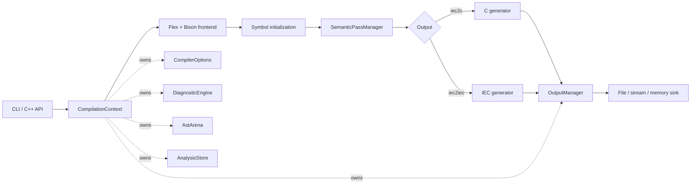

<div align="center">

# MATIEC

### IEC 61131-3 source in. Portable C out.

A modernized, testable compiler pipeline for Structured Text, Instruction List,
and textual Sequential Function Chart programs.

[](https://github.com/mengmengjiang1999/matiec/actions/workflows/ci.yml)


[Get started](#quick-start) · [Use the compiler](#usage) ·
[Explore the architecture](#architecture) · [Read the docs](#documentation) ·
[Release 1.6.0](docs/releasing.md)

</div>

---

## Why MATIEC?

MATIEC turns textual PLC programs into C that can be compiled for a target
runtime with a standard C toolchain. This repository keeps the language
behavior of the original MATIEC compiler while rebuilding its internal
boundaries for maintainability, embedding, and regression testing.

| Predictable | Embeddable | Verifiable |
| --- | --- | --- |
| Explicit semantic pass order and structured failures | One `CompilationContext` per compilation | GCC, Clang, generated-C, ABI, runtime, and sanitizer coverage |

> [!IMPORTANT]
> Generated code must be compiled, linked, and validated for its target PLC
> runtime. MATIEC is not approved for safety-critical use without an
> independent, application-specific review.

## What is included?

| Interface | Purpose |
| --- | --- |
| `iec2c` | Validate IEC 61131-3 source and generate ANSI C sources and headers |
| `iec2iec` | Validate source and emit normalized IEC text |
| `matiec::Compiler` | Invoke the compiler from C++ without command-line parsing |

### Language coverage

- **Structured Text (ST)** — supported
- **Instruction List (IL)** — supported
- **Sequential Function Chart (SFC)** — supported in textual form
- **Function Block Diagram (FBD)** — graphical input is not parsed directly
- **Ladder Diagram (LD)** — graphical input is not parsed directly

ST, IL, and textual SFC declarations can coexist in the same input file. The
frontend follows the project's IEC 61131-3 2nd Edition grammar and also accepts
the historical include pragma:

```text
{#include "filename" }
```

### Language profiles

Both tools support an explicit `--std=<profile>` selector:

| Profile | Meaning |
| --- | --- |
| `legacy` | Default. Preserves the existing MATIEC language and generated output. |
| `iec61131-3:2025-experimental` | Opt-in path for independently implemented features backed by public evidence. It is not a complete or certified conformance claim. |

The experimental profile currently adds validated UTF-8 source/`STRING` literals,
reference declaration initialization, and deliberately provisional MATIEC
namespace, function-block method, and configuration-level `VAR_ACCESS` subsets.
These behaviors are documented as project extensions because the complete normative
2025 rules are not publicly available. Existing switches
such as `-r`, `-R`, `-s`, `-n`, and `-a` remain independent extensions and are not
enabled by selecting a profile.

Namespace quick example:

```iecst
NAMESPACE Factory.Motion
TYPE Speed : INT; END_TYPE
END_NAMESPACE

PROGRAM Main
  VAR Current : Factory.Motion.Speed; END_VAR
END_PROGRAM
```

See the [namespace semantics](docs/standards/namespace-semantics.md) for supported
syntax, visibility, lookup, cross-include behavior, and known limits. Namespace
source is handled directly by the reentrant lexer/parser; it is not rewritten by a
compatibility normalizer.

Access-variable quick example:

```iecst
VAR_ACCESS
  RemoteSetpoint : Setpoint : INT READ_WRITE;
END_VAR
```

This bounded form exports validated configuration/resource globals and resource
program-output paths, including structure fields and constant array subscripts, to
`ACCESS.csv`.
See the [access-variable semantics](docs/standards/access-variable-semantics.md) for
the supported path and direction rules.

The first object-oriented increment supports public methods owned by a function
block with static dispatch, nested call expressions, and declarations loaded from
filesystem or virtual includes. Native method nodes own their semantic bindings;
no compatibility declaration is appended to the parsed library. It does not yet
implement classes, interfaces, inheritance, overrides, properties, or dynamic dispatch. See the
[object method semantics](docs/standards/object-method-semantics.md).

The experimental standard-library layer also supports standalone
`ASSERT(boolean-expression);` calls with a deterministic released/no-op runtime
policy. See the [experimental ASSERT semantics](docs/standards/experimental-assert-semantics.md).

## Quick start

```sh
git clone git@github.com:mengmengjiang1999/matiec.git
cd matiec

autoreconf --install
./configure
make --jobs=2
make check
```

<details>
<summary><strong>Build prerequisites</strong></summary>

| Tool | Minimum version |
| --- | --- |
| Autoconf | 2.69 |
| Automake | 1.16 |
| Bison | 2.4 |
| Flex | 2.6 |
| C/C++ compiler | GCC or Clang |
| Make | GNU Make or compatible |

A prepared source archive may include generated build files and begin with
`./configure`; a Git checkout should run `autoreconf --install` first.
Automake uses `subdir-objects`, so generated objects mirror source directories
and clean in-tree and out-of-tree builds use the same layout.
The generated scanner provides its own `yywrap()` callback; no external Flex
runtime library is required by the compiler link.
Shared compiler support is built once in `libcompiler.a`; executable and test
targets do not compile private copies across recursive build directories.

</details>

## Usage

### Compile IEC source to C

Given `counter.st`:

```iecst
PROGRAM Counter
  VAR
    value : INT := 0;
  END_VAR

  value := value + 1;
END_PROGRAM
```

create an output directory and run `iec2c`:

```sh
mkdir -p build/generated
./iec2c -I lib -T build/generated counter.st
```

Depending on the declarations in the input, MATIEC emits POU, configuration,
resource, and support sources. Headers needed by generated C are in `lib/C`.

### Normalize IEC source

```sh
./iec2iec -I lib counter.st > normalized.st
```

Select a profile explicitly when testing migration behavior:

```sh
./iec2c --std=legacy -I lib -T build/generated counter.st
./iec2iec --std=iec61131-3:2025-experimental -I lib counter.st
```

Both tools accept exactly one input file. They return a non-zero status for
invalid arguments, parse failures, semantic errors, or output failures.

```sh
./iec2c -h
./iec2iec -h
```

Use `-h` to inspect include-path, output-path, language-extension, diagnostic,
and generator options.

## Architecture



### A compilation is an owned lifetime

`CompilationContext` owns the options, diagnostics, AST arena, typed analysis
store, parser state, source manager, and output manager for one compilation. The source manager accepts either a path or
owned source bytes with an independent diagnostic display name. Destroying the context releases its AST
nodes and retained parser strings. Separate contexts support repeated,
sequential compilations without leaking state between runs. The generated
frontend also supports overlapping parses for independent contexts on separate
threads. Parser sessions carry their context-owned AST arenas and declaration
tables, so direct allocation and legacy declaration lookup remain aligned with
one selected context without secondary active bindings.
`Compiler::compile_parallel()` runs the full pipeline for a bounded batch of
distinct contexts and preserves input order in its results.

Semantic flow, constants, datatype candidates, final datatype/scope selections,
invocation declaration resolution, and scope-specific enumeration tables are
retained in that store. Stage 4 writes and reads named generator annotations there
as it emits output. All six typed record families now have production boundaries.
Completed flow edges, constant values, candidate datatypes, selected datatypes,
and declaration scopes are read through compilation-scoped typed accessors by
semantic passes and Stage 4, so no completed analysis family is copied back onto
AST nodes in production. Flow analysis and constant propagation update their
records directly; IL instruction nodes no longer store edge vectors and the AST
base no longer stores constant values. Candidate filling and narrowing likewise
update datatype records directly, and the AST base contains no candidate,
selected-type, or declaration-scope annotations. Context-owned transient flow,
constant, datatype, resolution, and enumeration records cover stack-local and
immutable shared helpers. Resolution filling/narrowing and enumeration checking
update those records directly; lvalue validation and Stage 4 consume them without
AST fields or publication walks. Generator annotations remain off the AST and need no
post-generation publish/materialize cycle. Whole-tree compatibility
materializers have been removed, so typed records are the only completed-result
interface. Every semantic producer, semantic consumer, and generator receives
the context-owned store explicitly; there is no active analysis scope or
thread-local analysis pointer.

### Semantics are explicit passes

`SemanticPassManager` executes identified passes with declared prerequisites:

```text
enum declarations
  → flow control
  → constant propagation
  → declaration safety
  → type safety
  → lvalue / array range / case elements
  → dependency ordering
```

A failed pass stops its dependants. Lower layers report diagnostics and typed
results rather than terminating the process. Generated scanner fatal paths also
throw `CompilationAbort`, which the compiler boundary converts to a failed
result while leaving an embedding host in control.

### Output is a boundary

Generators write through `OutputManager` and `OutputSink`. File, stream, and
memory sinks share the same write and flush error handling. Production driver
outputs are selected from `CompilerOptions`; memory and custom sinks are
available at the generator-component boundary.

### Legacy code is contained

Parser runtime options, transition controls, and classification tables are
context-owned and supplied explicitly to stage 1/2 entry points. Bison parser
invocation state is automatic, and Flex allocates a reentrant scanner handle
whose generated and handwritten mutable state belongs to that parse. Both
receive the owning `ParserState&` directly. `LegacyGlobalStateAdapter` enters
narrow AST-arena, declaration-table, and runtime-option scopes for older
downstream code; it does not expose an active parser selector. Full-pipeline
parallel compilation and same-thread nested compilation from include callbacks
are supported for distinct contexts.

## Embed from C++

```cpp
#include <iostream>

#include "compiler/compilation_context.hh"
#include "compiler/compiler.hh"

int main() {
  matiec::CompilationContext context;
  context.options().language_profile =
      matiec::LanguageProfile::iec61131_3_2025_experimental;
  context.set_source_path("counter.st");
  context.options().include_directory = "lib";
  context.options().output_directory = "build/generated";

  const matiec::CompilationResult result =
      matiec::Compiler().compile(context);

  context.diagnostics().render(std::cerr);
  return result.succeeded() ? 0 : 1;
}
```

Embedding callers can compile source that is already in memory without creating
a named temporary file:

```cpp
context.set_source("memory://counter.st", source_text);
```

Independent contexts can be compiled as an ordered, bounded batch:

```cpp
std::vector<std::reference_wrapper<matiec::CompilationContext>> jobs = {
    std::ref(first_context), std::ref(second_context)};
std::vector<matiec::CompilationResult> results =
    matiec::Compiler().compile_parallel(jobs, 2);
```

Each context must appear only once in a batch and must use an independent output
directory. A `max_concurrency` value of zero selects a positive worker count
automatically. Returned results always correspond to the input context at the
same index; one failed compilation does not stop the other jobs.

Filesystem include pragmas still resolve through `include_directory`.

This C++ interface remains a source-level integration API. The stable binary
boundary begins with the C-compatible [`include/matiec/api.h`](include/matiec/api.h)
version contract. API version 1.6 provides opaque context lifecycle, copied
memory and file inputs, essential per-compilation options, and structured
success/error counts without exposing C++ implementation layouts. It also
supports ordered diagnostic delivery and generated-output callbacks, allowing
an embedding host to capture artifacts without filesystem writes:

```c
matiec_context_t *context = NULL;
matiec_result_t result = MATIEC_RESULT_INIT;

if (matiec_context_create(&context) == MATIEC_STATUS_OK) {
  matiec_context_set_source_path(context, "counter.st");
  matiec_context_set_include_directory(context, "lib");
  matiec_context_set_syntax_only(context, 1);
  matiec_context_compile(context, &result);
  for (size_t i = 0; i < matiec_context_diagnostic_count(context); ++i) {
    matiec_diagnostic_t diagnostic = MATIEC_DIAGNOSTIC_INIT;
    matiec_context_get_diagnostic(context, i, &diagnostic);
    /* consume stable diagnostic.code, phase, message, and optional range */
  }
  matiec_context_destroy(context);
}
```

Independent C contexts can be submitted to `matiec_compile_batch`; results keep
the same indexes as their contexts, and `max_concurrency == 0` selects an
automatic positive worker count. Contexts must not be duplicated in a batch,
and shared callback state must be synchronized because callbacks can run on
worker threads.

Memory-backed compilations may install a virtual include resolver with
`matiec_context_set_include_resolver`. The resolver supplies copied source bytes
and diagnostic display names for nested `{#include "..."}` pragmas, allowing a
complete compile without temporary source files. While installed it is
authoritative unless it explicitly returns `MATIEC_INCLUDE_USE_FILESYSTEM`;
clear it to restore unconditional filesystem include lookup.

Untrusted compilations can be bounded with `matiec_context_set_limits`.
`MATIEC_LIMITS_INIT` defaults source bytes, retained diagnostics, and aggregate
generated-output bytes to unlimited; set any field to a nonzero budget to opt
in. `matiec_context_cancel` is safe to call from another thread while the
context compiles. Cancellation remains sticky until
`matiec_context_reset_cancel`, making context reuse explicit and predictable.
Cancellation and exhausted budgets return a normal API status with
`result.succeeded == 0` and an explanatory diagnostic.

Diagnostics expose stable `MATIEC-{N,W,E,F}dddd` identifiers and an API,
source, parser, semantic, or generation phase. `range_valid` explicitly guards
the file/line/column range; `offset_valid` independently guards zero-based byte
offsets. This lets IDE integrations classify and navigate diagnostics without
parsing presentation text.

## Install the embedding library

```sh
./configure --prefix=/desired/prefix
make
make install
```

The install contains `<matiec/api.h>`, self-contained static and ABI-versioned
shared `libmatiec` libraries, `matiec.pc`, IEC library definitions under
`share/matiec/lib`, and generated-C runtime headers under
`share/matiec/lib/C`. A C host should compile its source with `cc` and perform
the final link with `c++`; `pkg-config --cflags --libs matiec` selects the shared
library by default, while explicitly naming `libmatiec.a` retains static linking.
Configure each embedding
context's include directory to the installed `share/matiec/lib` path.

Run `make check-api` to validate the exported `matiec_*` symbol allowlist,
complete C11/C++17 header signatures, and a staged external consumer. The same
contract runs in the dedicated GitHub Actions `api-compatibility` job. Additive
public functions require a minor embedding API version increment and allowlist
update; incompatible signatures or removals require a new major version.

See the
[embedding API contract](docs/architecture/embedding-api.md). AST pointers are
context-owned and must not outlive their `CompilationContext`.

The profile is a typed per-compilation option; it does not introduce mutable
process-global configuration. Embedders that omit it retain the legacy default.

## Quality gates

```sh
# Complete regression suite
make check

# Isolated AddressSanitizer + leak checks
make check-asan

# Isolated UndefinedBehaviorSanitizer checks
make check-ubsan

# ThreadSanitizer (on supported compiler runtimes)
make check-tsan

# Version alignment plus a clean source-package build/install/uninstall cycle
make release-check
```

GitHub Actions runs all three sanitizer suites as independent Linux jobs for every
push and pull request. The workflow is also available through manual dispatch.
Linux ASan jobs include leak detection; Apple Clang runs address checks without
the unsupported LeakSanitizer mode.

The regression suite covers:

- compiler services, diagnostics, AST ownership, and pass metadata;
- pass ordering, prerequisites, and failure short-circuiting;
- invalid-then-valid sequential compilation;
- aggregate/member lookup plus IN, OUT, and IN_OUT call-direction regressions,
  including rejected literal IN_OUT arguments and duplicate declarations;
- repeated bounded parallel batches with context reuse, mixed failures,
  callback fault injection, and output isolation;
- CLI behavior and syntax/initialization regressions;
- in-memory and byte-characterized generator output;
- generated-C compilation, ABI symbols, linking, and representative runtime
  behavior.

GitHub Actions runs clean GCC/Linux and Clang/macOS builds. Test artifacts are
isolated from tracked source files.

## Project map

```text
compiler/             Compiler API, context, diagnostics, AST arena, passes, output
stage1_2/             Scanner, grammar, parser, legacy frontend adapter boundary
absyntax/             AST node model and visitor base classes
absyntax_utils/       Symbol lookup, traversal, and datatype helpers
stage3/               Semantic analysis implementations
stage4/               C and normalized-IEC generators
lib/                  IEC library and generated-C runtime support
tests/                Unit, regression, characterization, ABI, and sanitizer tests
docs/                 Architecture contracts and design decisions
openspec/specs/        Current requirements
openspec/changes/      Archived change records
```

## Documentation

- [中文用户手册：支持的 IEC 61131-3 语法](docs/user-manual.zh-CN.md)
- [IEC 61131-3 演进与实验性 2025 Profile 决策](docs/standards/iec61131-3-evolution.zh-CN.md)
- [Compiler boundaries](docs/architecture/compiler-boundaries.md)
- [Versioned embedding API](docs/architecture/embedding-api.md)
- [Release process](docs/releasing.md)
- [Legacy global-state adapters](docs/architecture/legacy-global-state-adapters.md)
- [AST ownership inventory](docs/architecture/ast-ownership-inventory.md)
- [Architecture decisions](docs/decisions/)
- [OpenSpec requirements](openspec/specs/)

## Contributing

Keep language behavior and generated output stable unless a change is
intentional and covered by a regression. New compiler work should follow these
boundaries:

- per-compilation state belongs in `CompilationContext` or an owned service;
- semantic work is registered as a pass with explicit prerequisites;
- AST-lifetime objects are owned by the context arena;
- generators write through an output sink;
- lower layers return structured failures instead of calling `exit()`;
- requirement changes update `openspec/specs/`;
- changes to `configure.ac` or `Makefile.am` include refreshed Autotools files.

Run `make check` before publishing. Use the sanitizer targets for parser-state,
ownership, memory-lifetime, or concurrency changes. Before tagging a release,
run `make release-check` and follow the [release process](docs/releasing.md).

## Roadmap boundaries

- Direct graphical FBD and LD input
- Validation against later IEC 61131-3 editions

These are boundaries, not promises or scheduled milestones. Current behavior is
defined by the tests and [OpenSpec requirements](openspec/specs/).

Context-owned semantic analysis storage and explicit dependency migration are
complete: all six typed record families have production boundaries, completed
results stay in `AnalysisStore`, and all semantic and generator result fields
have been removed from the AST. Stage 3 and Stage 4 receive the owning context's
store explicitly, without a compatibility result store or ambient binding.

The frontend reentrancy architecture track is complete. Parser and scanner
helpers receive `ParserState` explicitly and no active-parser selector remains.
Generated Bison state is invocation-local; each Flex invocation has an explicit
reentrant scanner handle containing its buffers, locations, include frames, and
handwritten lookahead state. Parser classification and declaration symbol tables
are owned by each `CompilationContext`. Regression coverage exercises both
parallel contexts and a synchronous nested compilation from an include callback
without a global lock or thread-local scanner state. `Compiler::compile_parallel()` and its
full-pipeline regression now cover ordered results, mixed success/failure,
independent parser/AST/diagnostic state, and isolated generated output.
The normal regression suite audits these architecture invariants. Recursive
same-thread entry into the Flex scanner is an explicit boundary, not unfinished
work in the supported parallel-compilation contract.

## Project origin and license

MATIEC is derived from the original IEC 61131-3 compiler based on the
**FINAL DRAFT — IEC 61131-3, 2nd Edition (2001-12-10)**.

**Copyright (C) 2003–2012 Mario de Sousa (msousa@fe.up.pt)**

The original project also includes contributions from Laurent Bessard, Edouard
Tisserant, and other contributors. Copyright notices in individual source files
remain authoritative.

Compiler sources are distributed under the GNU General Public License stated in
their file headers, generally GPL version 3 or (at your option) any later
version. See [COPYING](COPYING).

Some runtime and support files under `lib/` use the GNU Lesser General Public
License. See [lib/COPYING.LESSER](lib/COPYING.LESSER) and the applicable file
header for the exact version and terms.

This README does not replace or alter any original copyright or license notice.
